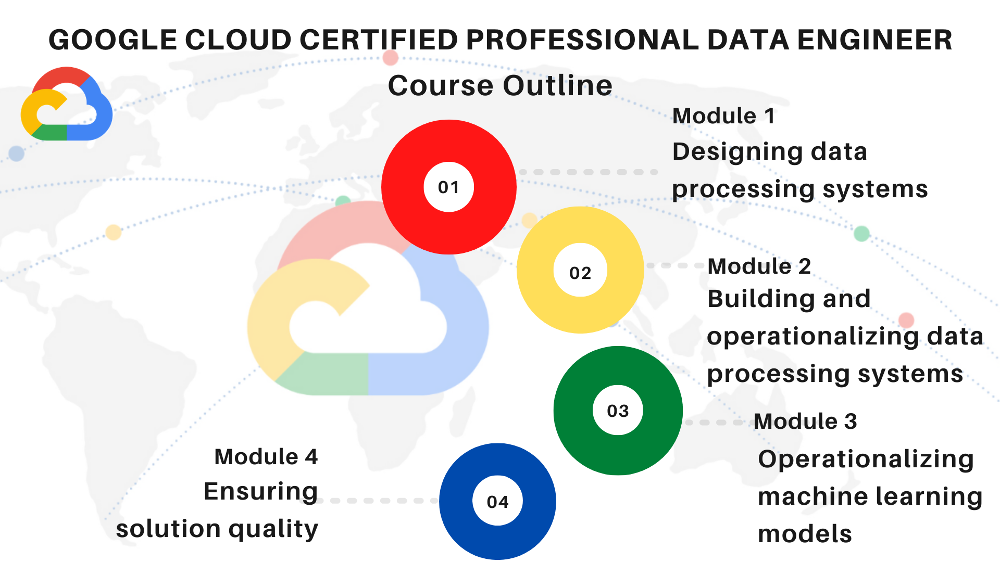

# Google Cloud Platform for Data Engineers: Practical Project

**ELT with BigQuery, GCS, Airflow, Python, and SQL - Real-world project on GCP, from data ingestion to Machine Learning.**

## Objectives of the Projects

1. **Understand the Fundamental Concepts of Data Engineering and the Difference Between ETL and ELT**

   Gain a solid understanding of data engineering principles and the distinctions between ETL (Extract, Transform, Load) and ELT (Extract, Load, Transform) processes. This knowledge is essential for effectively structuring data flows in your projects. 

2. **Explore the GCP Environment and Utilize Key Data & Analytics Services**

   Familiarize yourself with Google Cloud Platform (GCP) and learn to use its primary data and analytics services, including BigQuery, Cloud Storage, and Cloud Composer, to build efficient data pipelines. 

3. **Extract and Store Data in Google Cloud Storage (GCS)**

   Learn to automate the download of raw data files using Python scripts and command-line tools, storing them securely in GCS for further processing.

4. **Load and Transform Data in BigQuery**

   Understand how to design datasets and tables in BigQuery, optimizing them for advanced analytics and efficient querying.

5. **Orchestrate and Automate an ELT Pipeline with Apache Airflow (Google Composer)**

   Develop skills to schedule and monitor data workflows by orchestrating ELT pipelines using Apache Airflow within the Google Composer environment.

6. **Analyze Data with SQL in BigQuery**

   Utilize SQL queries in BigQuery to analyze data, create views, and address business questions related to market demand, pricing, and competition.

7. **Create Interactive Reports with BigQuery Notebooks and Python**

   Learn to visualize and interpret data trends effectively by developing interactive reports using BigQuery Notebooks and Python.

8. **Build Machine Learning Models with BigQuery ML**

   Apply advanced modeling techniques within BigQuery to develop machine learning models for prediction and performance analysis.

By the end of this course, you will be equipped to design and deploy a comprehensive ELT pipeline on GCP, automate data processing tasks, and leverage cloud capabilities for analytics and machine learning.

## Business Case 

#### Analysis of demand seasonality

#### Customer behavior

#### Financial performance, and operational efficiency